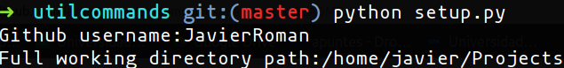

# Util commands
Some util linux commands.
### Prerequisites
* Python3
* PyGithub
```
pip install PyGithub
```

### Newproject command
```
newproject project_name
```
This command creates a repository with the specified name using github api and it creates the corresponding project folder in your file system. Additionally it opens VS Code in that specific folder.
### Delproject command
```
delproject project_name
```
This command deletes a project from your file system and from github.

### More commands
I'll be adding more commands, feel free to contribute!

## Setup and installation
For this step you'll need an access token from github. Here's a link that shows how to get it:
https://help.github.com/en/articles/creating-a-personal-access-token-for-the-command-line

First of all run setup.py:
```
python setup.py
```

Specify your github username and the full working directory path and the personal access token.


This process creates two files that will be used by those commands to perform the required actions.
```
chmod +x install.sh
./install.sh
```
Install it and enjoy it!

## Contribute
Contributions are very welcome!
