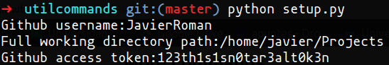

# Util commands
Some util linux commands.
### Prerequisites
* Python3
* PyGithub
```
pip install PyGithub
```

### Newproject command
```
newproject project_name
```
This command creates a repository with the specified name using github api and it creates the corresponding project folder in your file system. Additionally it opens VS Code in that specific folder.
### Delproject command
```
delproject project_name
```
This command deletes a project from your file system and from github.

### More commands
I'll be adding more commands, feel free to contribute!

## Setup and installation
First of all run setup.py:
```
python setup.py
```
Specify your github username and the full path to your projects working directory


After that you need an access token from github. Here's a link that shows how to get it:
https://help.github.com/en/articles/creating-a-personal-access-token-for-the-command-line

Once you have it paste it.<br/>

